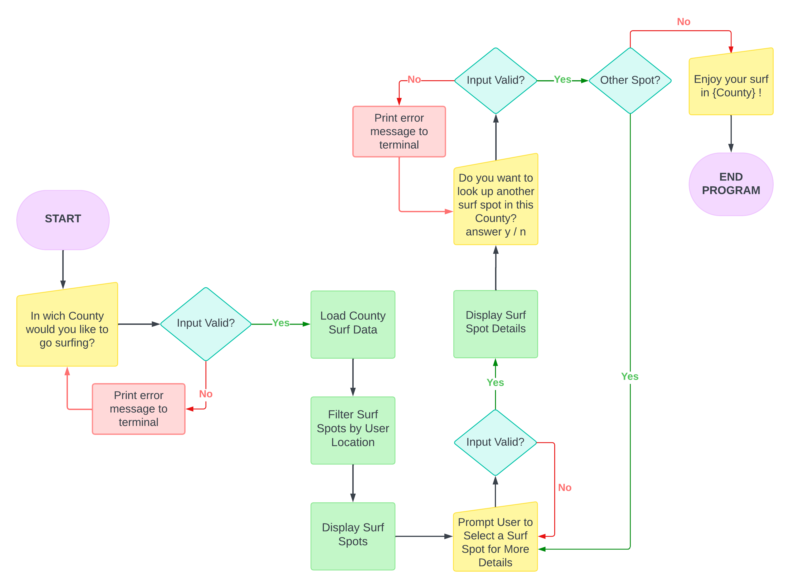
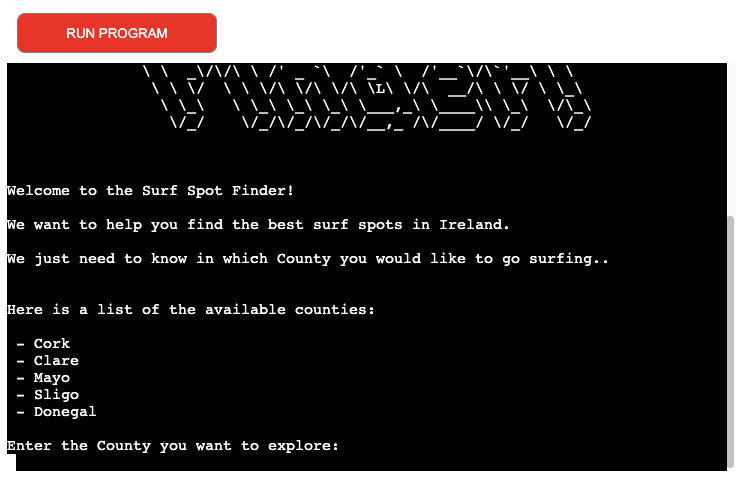
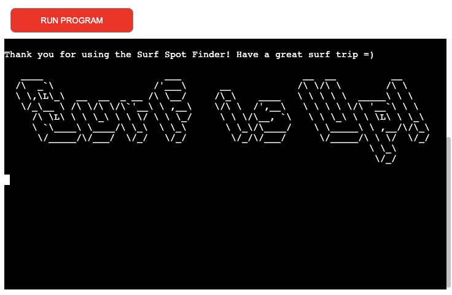

# SURF SPOT FINDER


[View Live Website here.](https://surf-spot-finder-820cebbbff26.herokuapp.com/)

[View the Google Sheet here.](https://docs.google.com/spreadsheets/d/1KqClUKt4qPwd4cuOM1b8-stC4H44OkL4tIA6QGkQJs0/edit?usp=sharing)

[GitHub Repo](https://github.com/LemmenAid/surf-spot-finder)

*** 

## Project Description  

_Surf Spot Finder is a CLI application for my third portfolio project with [Code Institute](https://codeinstitute.net/ie/)._

The Surf Spot Finder is a CLI application that helps users find the best surf spots in different counties in Ireland. Users can choose from a list of available counties in Ireland to view the surf spots in that county. After selecting a county, the application will display a list of surf spots in that county.
Users can then choose a specific surf spot from the list to view more detailed information about that spot.

## Project Purpose

The Surf Spot Finder is a user-friendly command-line interface (CLI) application designed to help surf enthusiasts in Ireland discover the best surf spots. By providing a comprehensive database of surf spots across various counties, the application aims to enhance the surfing experience for both locals and visitors alike. With its intuitive features, the Surf Spot Finder simplifies the process of finding suitable surf spots, making it easier for users to plan their surfing adventures and make the most of Ireland's diverse coastal regions.

***

## Index – Table of Contents

* [User Experience (UX)](#user-experience)
* [Creating Process](#creating-process)
* [Design](#design)
* [Features](#features)
* [Libraries and Technologies Used](#libraries-and-technologies-used)
* [Testing](#testing)
* [Solved Bugs](#solved-bugs)
* [Deployment](#deployment)
* [Credits](#credits)

***

## User Experience (UX)

### User Stories

1. As a first time User, I want to easily understand the main purpose of the app. 
2. As a new User, I want to easily navigate the app. 
3. As a User, I want to be able to explore surfspots in Ireland per County.
4. As a User I want to be able to get more detailed information on different surfspots in Ireland.
5. As a User, I want to be able to explore several surfspots in the same County.
6. As a User, looking for surfspot options I want to be able to switch between different Counties. 

***

## Creating Process

I wanted to create something for my third portfolio project that could have a real-world application. I decided to create an app that would help surfers to explore different surf spots in Ireland per County. Having moved to Ireland myself, I was very eager to surf as many different spots as I could. The amount of surf spots in Ireland however is endless. Having an application that can give some structure and information would be very helpful to (new) surfers, so the Surf Spot Finder was created from this idea. 

I did not wanted to overly complicate my project, so I could focus on developing my Python skills, understanding the logic and write code with using minimal resources. To get me started the Love Sandwiches walkthrough project was a great help, especially because I wanted to practice using Google Sheets and decided to store the information used for the Surf Spot Finder in a spreadsheet. It was a steep learning curve that I was faced with during the making of this app, but the further I got into the project the more I found myself being able to figure parts of the code out by myself, which gave me a great confident boost.

### Logic Flow
Starting to design my project with a flowchart has been extremely helpful. It gave me an overview of the logic I needed to follow during the writing of the app. Creating this flowchart has helped me to break up the logic within functions, making the code more modular and easier to follow.

It also made it easier for me to navigate the debugging process more efficiently. The visual nature of the diagrams has enabled me to spot potential issues and trace the flow of execution more effectively, ultimately leading to a smoother development experience.

**There may be some differences because I drew the flowchart before I started my project.**



### Project SetUp

With this being my first Python project, my main goal was to create an application that displayed data successfully from Google Sheets worksheets to the User based on their input. 

I collected the surf spot information from several websites, which are linked in the Credits section of this ReadMe. I organized the information in a Google Spreadsheet.

Jump to Credits: [Credits](#credits)


After that I began by created the major functions to set up the main flow of the application. From there I started adding more detail and smaller functions. I added validation using while loops, as well as User options using if / elif statements. I constantly tested the validation of the User input to make sure that the User would receive the appropriate feedback and the application's flow would not get interrupted. 

Once I got the logic up and running I started adding functions that would enhance User experience, like the slow_print and the clear_terminal functions.

### Google Sheets

The worksheet is accessed by myself as the only Editor but I included a View only link to show the distribution of data for the project. 

[View the Google Sheet here.](https://docs.google.com/spreadsheets/d/1KqClUKt4qPwd4cuOM1b8-stC4H44OkL4tIA6QGkQJs0/edit?usp=sharing)

The Google Spreadsheet contains a sheet for each County, where the information for the surf spots in that County are stored. This way it would be easy to add information on surf spots and Counties in the furture.  


***

## Design

* ASCII art to make the welcome and good-bye screens a bit more interesting.
* The colour scheme of this app has not been changed, to keep it classic and simple.
* The type of script has also not been changed, the original one was well suited for this application.

***

## Features 

### ASCII Art

ASCII Art is used as a title for the app to improve the User experience and to add some visual interest.


### Slow Print

The text in the app are printed slowly to improve User experience and to make sure that the User is not overwhelmed by the text appearing on the screen.

### Welcome Message & Counties

* As soon as the page is loaded, the ASCII Art is displayed and a welcome message is gradually printed out. 
In the welcome message the purpuse of the app is explained. 

* After the welcome message a list of available Counties is displayed and the User is promted to choose a County where they want to go surfing and want to explore.



### Surfspots

* After choosing a County the terminal is cleared and a list of available surfspots for that County are displayed. The User is asked if they want to explore one of these surfspots or if they want to exit the program.


### Surfspot Details & Program Continue Options

* After choosing a spot more detailed information is given about the chosen spot.

* After more detailed info is given about the chosen surfspot, the User can choose between 3 options on how to continue in the app. They can either choose another surfspot in the same County, choose a different County they want to explore or exit the program.


### Goodbye Message

* If the User chooses to leave the program a goodbye message is displayed. 




### Future Implementations

* In the future, I could implement the User name and favorite surf spots tracking functionality.
* In the future I would like to add more information to the database, and cover all (coastal) Counties.
* Through further learning I would like to use a weather forcast API to add information to the surf spot details with current weather conditions.
* I would have loved to add a feature that User can store their favorite surf spots. After finishing the course I would like to come back to this project and create this feature. 

*** 

## Libraries and Technologies Used

* [Github](https://github.com/) - Used for hosting the repository.
* [Heroku](https://heroku.com/) - Used for deploying the live project.
* [Gitpod](https://www.gitpod.io/#get-started) - Used for developing the application.
* [Python](https://www.python.org/) - Used for adding functionality to the application.
* [Google Sheets](https://docs.google.com/spreadsheets/) - used for storing, editing and saving Surf Spot Finder database.
* [Google Cloud Platform](https://cloud.google.com/) - used to provide the APIs for connecting the data sheets with the Python code.
* [Lucidchart](https://lucid.co/) - Used for creating the app flowchart.
* [CI Python Linter](https://pep8ci.herokuapp.com/#) - Used for validation python code.

### Python Libraries

* [gspread](https://docs.gspread.org/en/v6.0.0/) - used to add, remove and manipulate data in the connected Google Sheets worksheets.
* [google.oauth.service_account](https://google-auth.readthedocs.io/en/master/reference/google.oauth2.service_account.html) - used for the authentication needed to access the Google APIs to connect the Service Account with the Credentials function. A CREDS.json file was generated with the details needed for the API to access the Google account which holds the Google Sheets worksheet containing the applications data. When deploying to Heroku, this information is then stored in the config var section to ensure the application will run.
* [Pyfiglet](https://pypi.org/project/pyfiglet/) - Used for the opening title and Goodbye message.
* [Time](https://docs.python.org/3/library/time.html) - Used for the slow print functionality and for delaying print statements.
* [Sys](https://docs.python.org/3/library/sys.html) - Used to provide access to some variables used or maintained by the interpreter.
* [Random](https://docs.python.org/3/library/random.html) - Used to add the slow_print functionality.
* [OS](https://docs.python.org/3/library/os.html) - Used to add the clear_terminal function for a neater flow of the program.

***

## Testing


### Python Validation

The [CI Python Linter](https://pep8ci.herokuapp.com/#) is used for validation python code. The run.py file was checked and a few errors were reported:


<br>
After fixing the errors, no errors were reported:

 


### Input Testing

During developments User input has been tested frequently to check if various inputs were valid, namely if the validation functions were catching all errors as expected. It was important that the User could easily navigate back to different County and surfspot options, as well as exiting the program. When testing User input I have repeatedly used the same set of input values: "Enter button only", "test" and "123".

All tests were completed in the local terminal as well as in the Heroku terminal.

| Feature                    | Tested?    | User Feedback Provided      |
|----------------------------|------------|-----------------------------|
| Choose County              | Yes        | Sorry, {user_county} is not a valid county. |
| Choose surfspot            | Yes        | {selected_spot} is not a valid surfspot. Please enter one of the available options.|
| Program continue options   | Yes        | {restart} is not a valid input! Please enter Y, N or C. |
| Exit                       | Yes        | Goodbye message is displayed |


### Browser Testing  
Surf Spot Finder was tested through the Heroku app website on the following browsers with no issues arising:  
- Google Chrome (Version 126.0.6478.182)
- Mozilla Firefox (Version 127.0.2)  
- Microsoft Edge (Version Version 126.0.2592.102) 

***

## Solved Bugs

* One bug that came up during testing was quite interesting and was only discovered by accident. The correct name for a County was entered, but accidentally had a blank space in front of it, the input was returned as not valid. After looking into this, I found that this could be solved by calling the .strip() function before calling the .capitalize() function on the User input:

 

***

## Deployment to Heroku

### Project Deployment

_I have used the README of https://github.com/lucia2007/towers-of-hanoi/ to write this part of the deployment section._<br>

The application was deployed to Heroku. In order to deploy, the following steps were taken:

1. If you have an account, login to Heroku. Otherwise create a new account.
2. Once signed in, click the "New" button in the top right corner, below the header and choose "Create new app".
3. Choose a unique name for the application and select your region. When done, click "Create app".
4. This brings you to the "Deploy" tab. From here, click the "Settings" tab and scroll down to the "Config Vars" section and click on "Reveal Config Vars". 

- In the KEY input field, enter "PORT" and in the VALUE input field, enter "8000". After that, click the "Add" button on the right.

- In KEY enter "CREDS", in VALUE, paste in the text content of your CREDS.json file. 

5. In the Settings tab, in the Buildpack section, click the button "Add Buildpack".
6. First add "Python" package and then "node.js". 
7. If you exchanged the order of the packages: the Python buildpack must be above the NodeJS buildpack. You can drag the Python buildback to the top.
8. Scroll back to the top of the page and go to the "Deploy" tab. Choose "GitHub" as your Deployment method.
9. Go to "Connect to GiHub" section, search for the repository name and click "Connect".
10. In the "Automatic Deploys" section, choose your preferred method for deployment. I chose the 'automatic' option. Click "Deploy Branch".
11. Once the building of the app is finished you can click the "view" button to be redirected to the newly deployed site.

### Forking repo on GitHub

_I have taken the following from the Sample README from Code Institute for this deployment section._ <br>

By forking the GitHub Repository we make a copy of the original repository on our GitHub account to view and/or make changes without affecting the original repository by using the following steps...

1. Log in to GitHub and locate the [GitHub Repository](https://github.com/)
2. At the top of the Repository (not top of page) just above the "Settings" Button on the menu, locate the "Fork" Button.
3. You should now have a copy of the original repository in your GitHub account.

### Making a Local Clone

1. Log in to GitHub and locate the [GitHub Repository](https://github.com/)
2. Under the repository name, click "Clone or download".
3. To clone the repository using HTTPS, under "Clone with HTTPS", copy the link.
4. Open Git Bash
5. Change the current working directory to the location where you want the cloned directory to be made.
6. Type `git clone`, and then paste the URL you copied in Step 3.

```
$ git clone https://github.com/YOUR-USERNAME/YOUR-REPOSITORY
```

7. Press Enter. Your local clone will be created.

```
$ git clone https://github.com/YOUR-USERNAME/YOUR-REPOSITORY
> Cloning into `CI-Clone`...
> remote: Counting objects: 10, done.
> remote: Compressing objects: 100% (8/8), done.
> remove: Total 10 (delta 1), reused 10 (delta 1)
> Unpacking objects: 100% (10/10), done.
```

***

## Credits

* I would like to thank Brian Macharia for his great mentor support and guidance - helping me through the process of building my first ever CLI application.
* My facilitator Amy from Code Institute for supporting us through our third project and giving us great tips and resources for learning tools, and her feedback during the weekly stand-ups.
* At last I would like to give thanks to my friends and family for taking the time to test the application and giving me great feedback.

### Content

I have taken information from the following websites for the Surf Spot Google Sheet:
* [Surf Forecast](https://www.surf-forecast.com/)
* [Discovering Cork](http://www.discoveringcork.ie/surfing/)
* [Surfer Today](https://www.surfertoday.com/surfing/the-best-surf-spots-in-ireland)
* [Surfline](https://www.surfline.com/travel/ireland-surfing-and-beaches/2963597)


### Code

The walkthrough project "Love Sandwiches" was a great way of understanding how to get started on an CLI application and it was therefor a good source of inspiration. 
I decided to make an app that can help users to find information on surfspots per County in Ireland. 
I have used various resources to help me with figuring out how to create the Surf Spot Finder app:

* [Stack overflow](https://stackoverflow.com/)
* [Pep Style Guide](https://peps.python.org/pep-0008/)
* [W3Schools](https://www.w3schools.com/)
* [The Hitchhiker's Guide to Python](https://docs.python-guide.org/writing/style/)
* [Real Python - for quick tutorials on several subjects](https://realpython.com/)
* [Real Python - Name-Main](https://realpython.com/if-name-main-python/)
* [Real Python - While loops](https://realpython.com/python-while-loop/)
* [Pypi - ASCII title banner](https://pypi.org/project/pyfiglet/)
* [Stack Overflow - Slow Printing](https://stackoverflow.com/questions/15375368/slow-word-by-word-terminal-printing-in-python)
* [Stack Overflow - clear terminal](https://stackoverflow.com/questions/2084508/clear-the-terminal-in-python)
* [W3Schools - strip()](https://www.w3schools.com/python/ref_string_strip.asp)
* [Tripleten - best practices](https://tripleten.com/blog/posts/python-best-practices)

* Code Institute Slack Channel


### Templates I have used for inspiration and creating my readme-file:

I have used several readme file as inspiration to write this readme:

* [Sample README Code Institute](https://github.com/Code-Institute-Solutions/SampleREADME/blob/master/README.md?plain=1) - Copied the Deployment section and used for general guideline.
* [Towers of Hanoi - Lucia2007](https://github.com/lucia2007/towers-of-hanoi/) - For general inspiration and the Heroku Deployment section for this readme.
* [Weather Checker - mdurmus](https://github.com/mdurmus/weather-checker/) - Used for general guideline.
* [Read Me Template Code Institute](https://github.com/Code-Institute-Solutions/readme-template/blob/master/README.md)
Used for general guideline.
* [Plant Factory - crypticCaroline](https://github.com/crypticCaroline/ms1-plantfactory/blob/master/README.md?plain=1) - Especially for the Technologies Used, Testing sections and design sections.
* [Visit Järbo - ClaudiaInSweden](https://github.com/ClaudiaInSweden/visit-jarbo/blob/main/README.md?plain=1) - General inspiration / guideline.
* [GitHub Docs](https://docs.github.com/en)